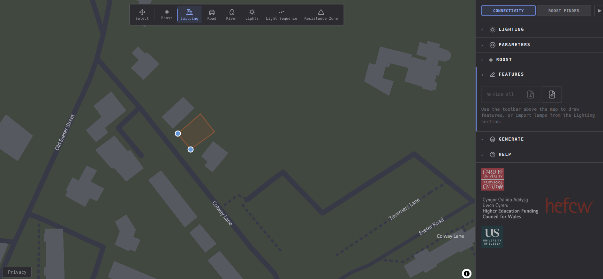
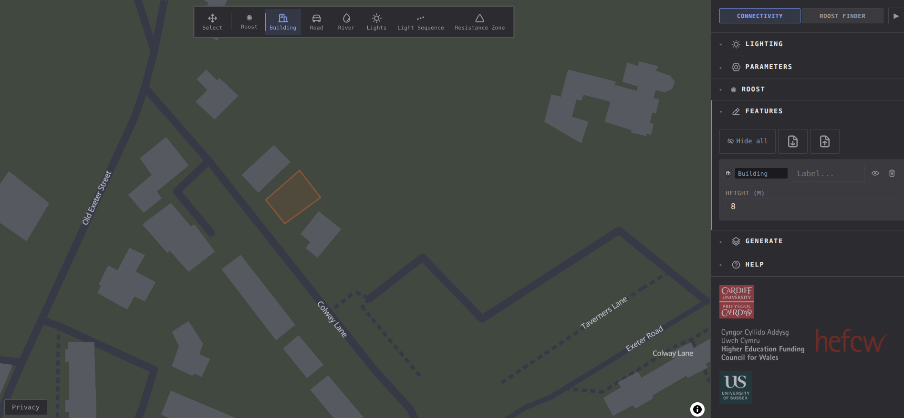

# Features

The RoostMapper app supports features added by the user, either by drawing them onto the map,
or by importing them as GeoJSON. User-created features can also be exported as GeoJSON.

## Drawing features

To draw a feature manually, select the feature type in the drawing toolbar. 
For example, select `Building`. Next, click points on the map to draw a polygon
representing the desired building. Click the first vertex added to close the polygon.

Once completed, the building will appear in the features panel, where a height can be
assigned to it. 

Visibility can be toggled with the eye icon, and the building can be deleted with the bin icon.
A label can be assigned for convenience.

Features can be exported and imported using GeoJSON files via the export and import buttons.

Other features types can be added in the same way, including:

- Roost location
- Buildings
- Roads
- Rivers
- Lights
- LightSequence (such as for a sequence of lights along a long road)
- GenericResistance. Generic resistance can be incorporated outside of the defined model resistance map parameters. Generally, this defines a zone of resistance with a user-defined resistance value. It is not processed by the pipeline, and instead is additive with the rest of the resistance map. 