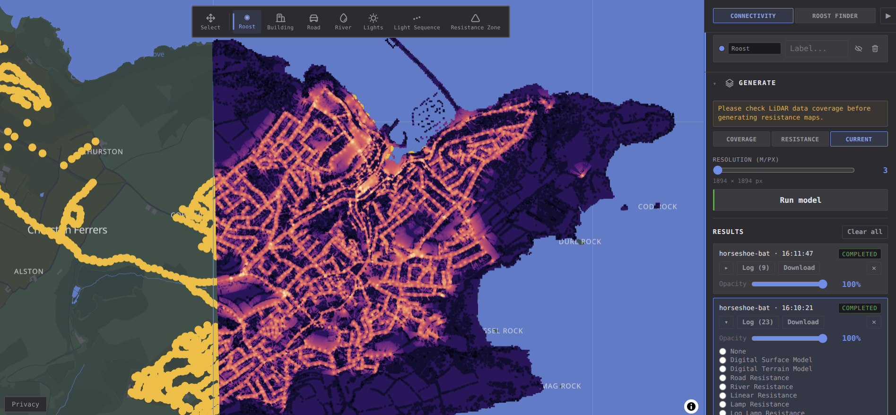
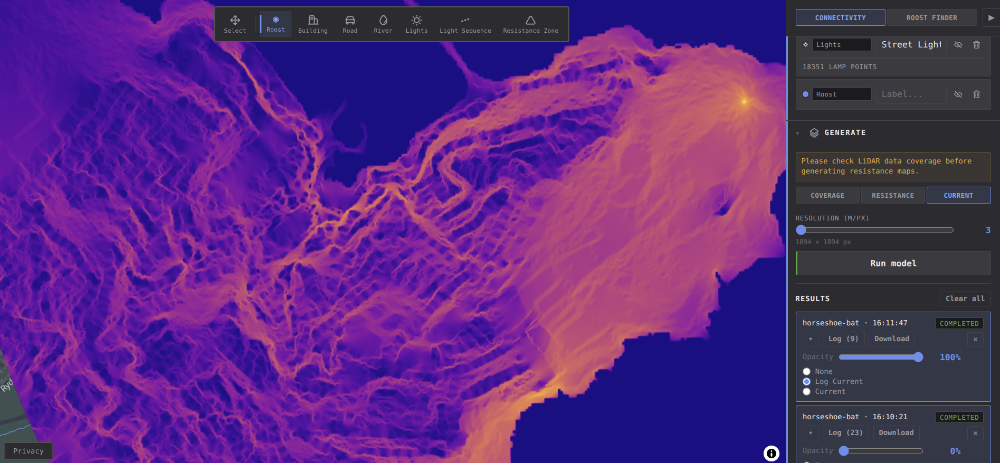
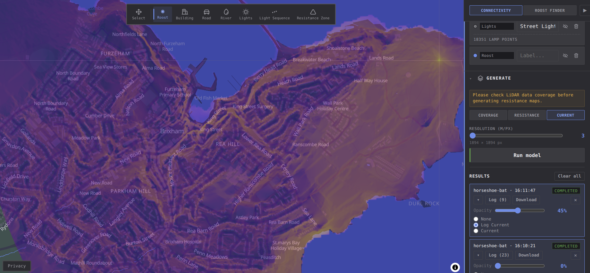

# Quick Start

## Loading data

In this example, we will import some street-lamp data and generate resistance and current maps.

Click the `LIGHTING` tab in the side-panel and select `Choose file` under import GeoJSON or CSV.

Once the lights are loaded, they should become visible on both the map and the `features` sidebar.

## Running the model

Click the `Generate` panel.

Firstly, select the desired resolution. Depending on the roost size, this may be limited. 

Next, choose `Resistance`, then `Run model`. The panel should display the job with
`Submitting` status. Once finished, the app will display the resistance map.

To generate a current map, next click `Current` and `Run model` as before. Generating current maps with Circuitscape will take longer than resistance map generation.

Adjust the transparency of the result in order to see the connectivity overlayed on the map.

## Next steps

See [[Sessions And Your Data]] for a detailed description on data sources.